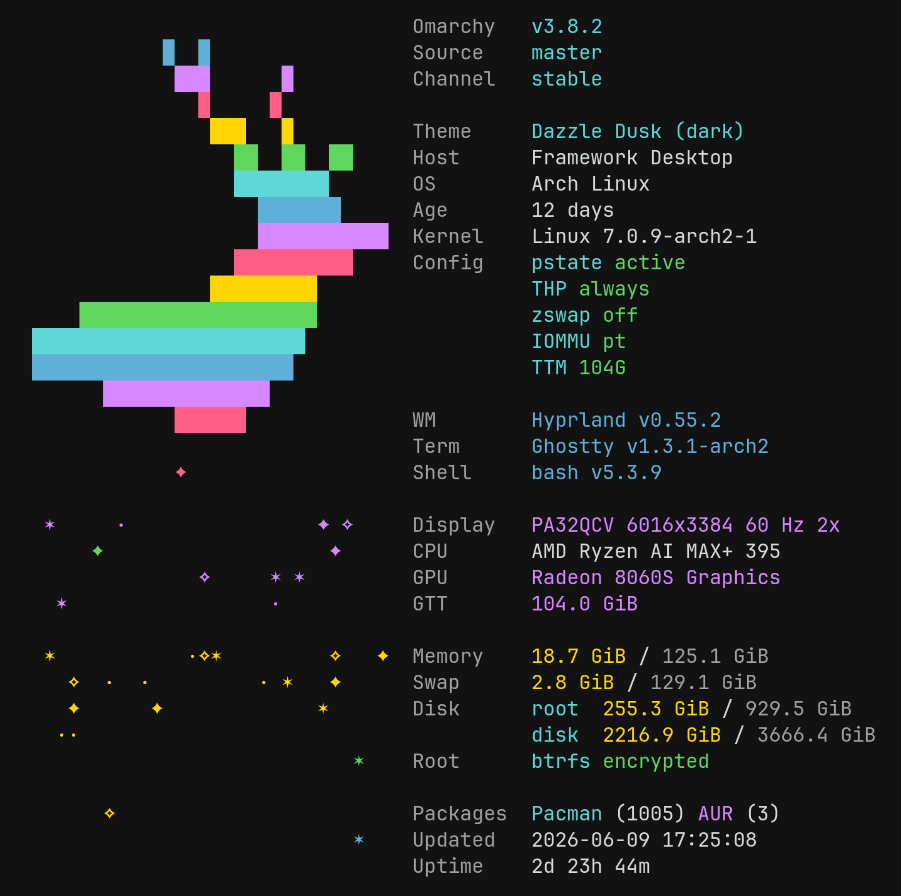

# omafetch



Omarchy-native Rust fetch tool.

`omafetch` is not a generic fetch clone. Omarchy decides how it looks;
`omafetch` decides what to show.

It reads Omarchy state from the existing Omarchy environment and renders a
polished system identity view. There are no theme, logo, color, style, preset,
or config flags.

On systems without Omarchy state, Omarchy-specific rows render as `unknown`.
Other system rows are collected from standard Linux files and common desktop
tools when available.

## Usage

Show the full Omarchy/system view:

```bash
omafetch
```

List available modules:

```bash
omafetch list
```

Show compact Omarchy identity context plus requested modules:

```bash
omafetch cpu memory shell
```

Explicit module output always keeps core identity context first:

```text
omarchy
theme
host
os
kernel
wm
```

Then it appends requested modules in the order provided, without duplicates.

## Output

- The Buck art uses terminal-theme ANSI colors.
- Labels are muted; values use normal foreground plus selective highlights.
- Long values are terminal-width aware and stay single-line unless a module deliberately emits continuation lines.
- `kernel-config` and `disk` use aligned multi-line values.
- The left-side sparkle field is deterministic: each sparkle row is encoded from that row's module/value.
- Unicode sparkles are used in UTF-8 locales: `· ✦ ✧ ✶`; ASCII fallback is `. + *`.

## Modules

Current modules include:

```text
omarchy
omarchy-source
omarchy-channel
omarchy-updated
theme
host
os
os-age
kernel
kernel-config
wm
terminal
shell
display
cpu
gpu
gtt-memory
memory
swap
disk
rootfs
battery
localip
packages
uptime
```

Default output renders the full module order. Unavailable `battery` and
`gtt-memory` are skipped in default output when they would be `unknown`, but can
still be requested explicitly.

## Release Artifacts

GitHub Actions builds release artifacts for Linux x86_64. Pushing a `v*` tag
creates a GitHub Release with:

```text
omafetch-<version>-x86_64-unknown-linux-gnu.tar.gz
omafetch-<version>-x86_64-unknown-linux-gnu.tar.gz.sha256
```

## Development

Run validation:

```bash
cargo fmt --check
cargo clippy --all-targets --all-features -- -D warnings
cargo test
cargo run
cargo run -- cpu memory shell
cargo run -- list
```

## Packaging

A starter Arch package recipe lives at:

```text
packaging/PKGBUILD
```

It builds the release binary and installs:

```text
/usr/bin/omafetch
/usr/share/doc/omafetch/README.md
/usr/share/licenses/omafetch/LICENSE
```

License: MIT, Copyright (c) 2026 Modoterra Corporation.
